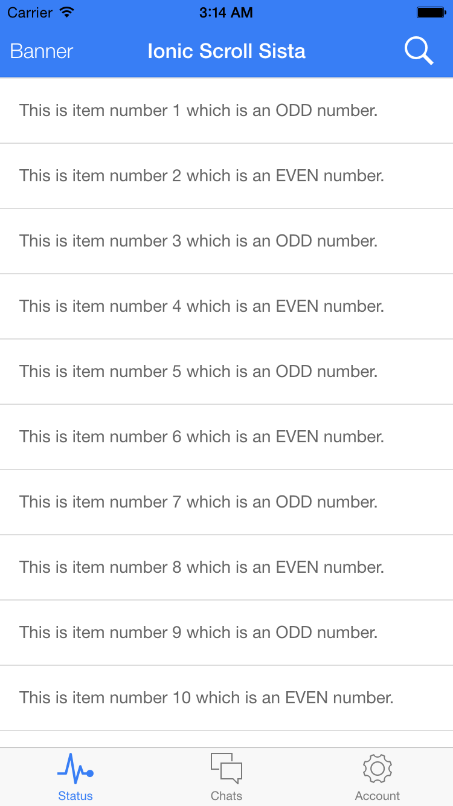
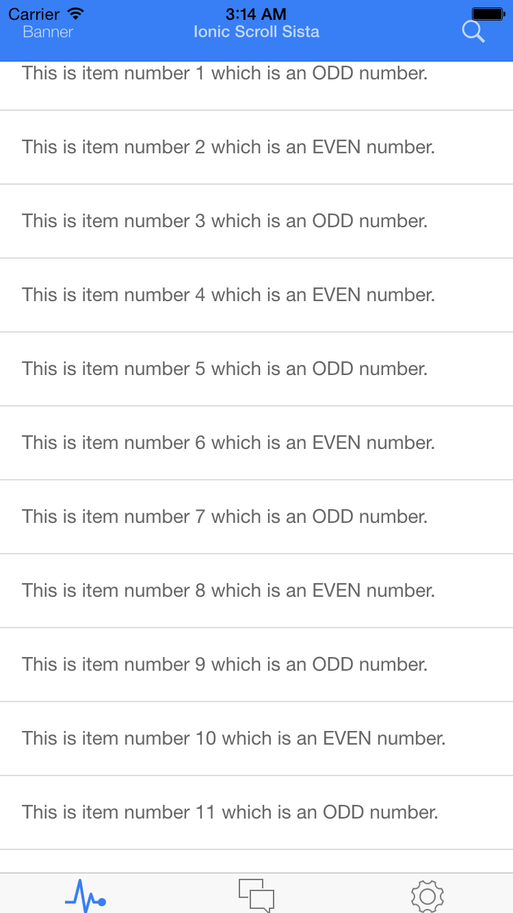
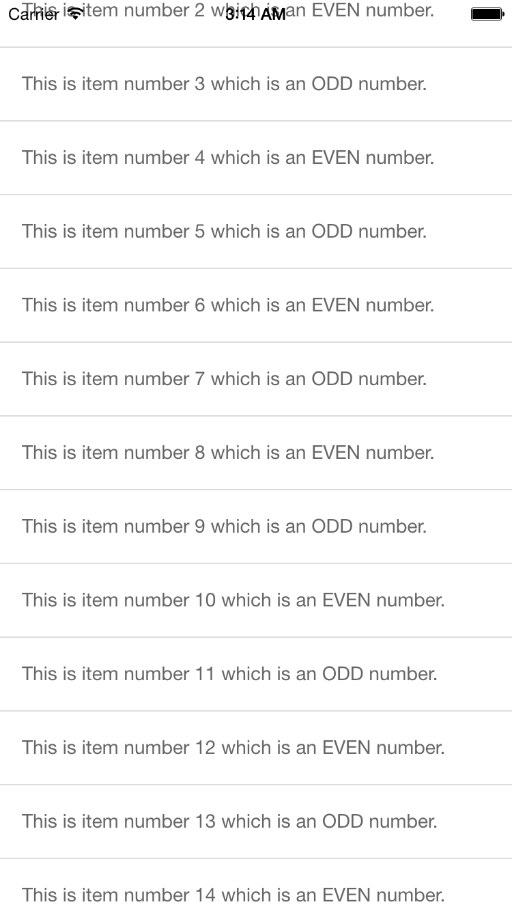
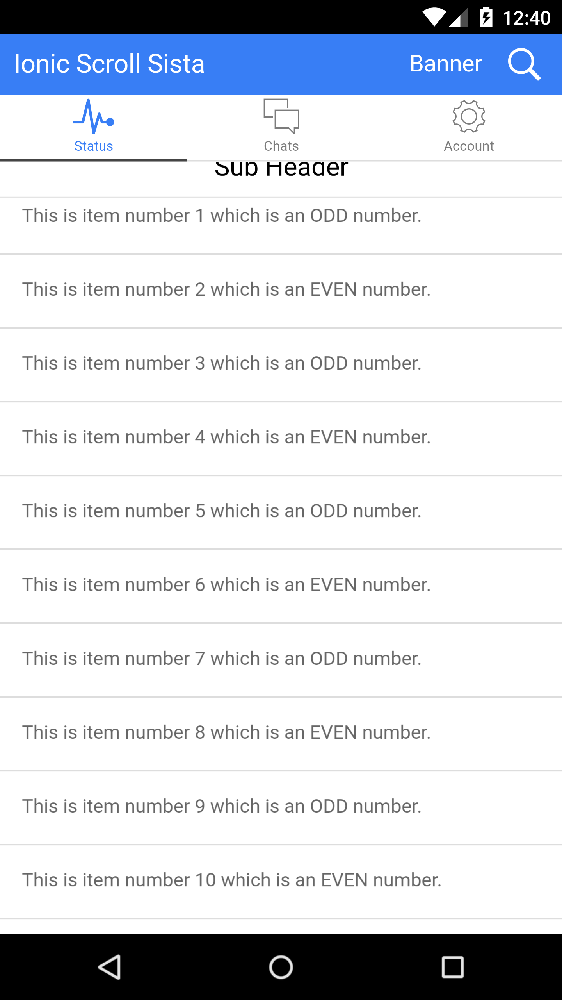
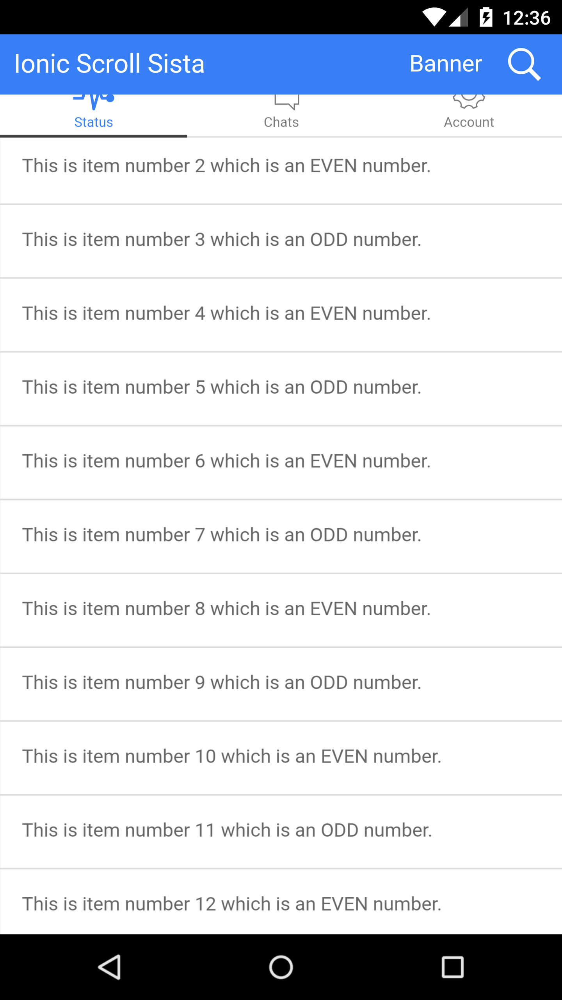
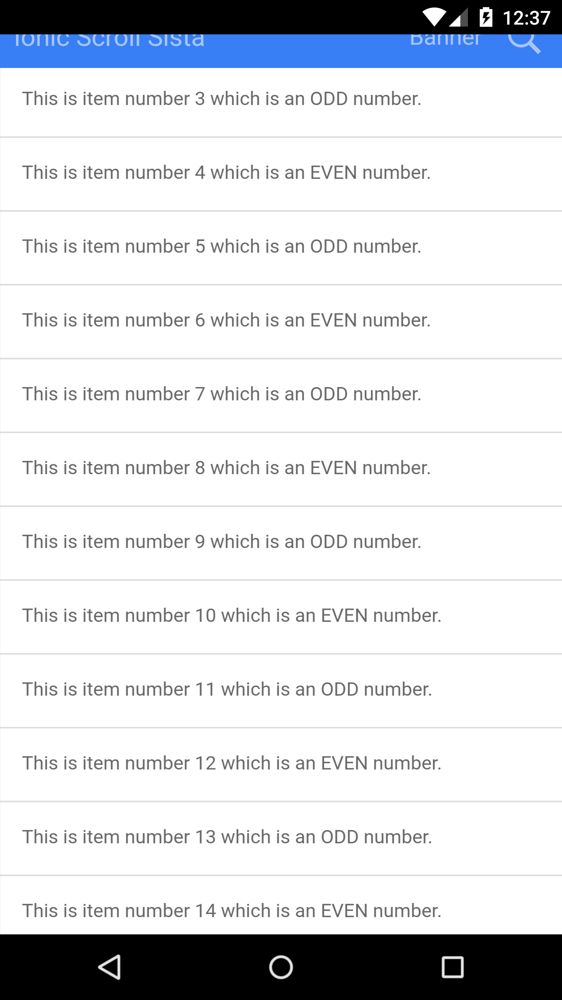

#Ionic Scroll Sista
>An Ionic plugin that will hide your header and tabs while scrolling a list to give users a little more room.  This plugin was inspired by [Ionic Header Shrink](https://github.com/driftyco/ionic-ion-header-shrink) however it doesn't seem that the repo is still maintained, not to mention it doesn't support the breaking changes from Ionic beta-14.

## Table of Contents
 - [Demo](#demo)
 - [Setup](#setup)
 - [Usage](#usage)
 - [NOTES](#notes)
 - [Screenshots](#screenshots)

## Demo

- Download my sports news app **SportScoop** on iOS/Android to see it live!! [Web Demo](http://www.sportscoopapp.com) | [iOS](https://itunes.apple.com/us/app/sportscoop/id1035164619?mt=8) | [Android](https://play.google.com/store/apps/details?id=com.coseur.sportscoop)

- Watch the Demo video below

- Download from [Ionic View](http://view.ionic.io/) with appId: `474d3495`

View the demo application code at demo/ for an example on how to use the filterBar.  To run the demo
clone the ionic-scroll-sista repo, then navigate to the demo/ directory and run the following

    npm install
    bower install
    gulp
    
## Setup

#### Install

`bower install ionic-scroll-sista`

#### JS Imports (index.html)

Include the following JavaScript file import in your index.html.  Remember to import the ionic libraries first!
The example below assumes your 3rd party bower dependencies are located in the default bower_components folder.

    

#### SASS FIX for Subheader placement

When all three (header/top tabs/subheader) are defined in the same view, Ionic doesn't position the subheader under the
top tabs by default.  If you wish to show all three in order Header/Top Tabs/Subheader, then you can import the
Ionic Scroll Sista SASS or CSS as shown below

SASS
    @import
        "path_to_bower_components/ionic/scss/ionic",
        "path_to_bower_components/ionic-content-banner/scss/ionic.scroll.sista";

#### Angular Dependency (app.js)

Add `jett.ionic.scroll.sista` as a module dependency of your app module.

    angular.module('Demo', ['ionic', 'jett.ionic.scroll.sista'])
      .config(function () {..});

## Usage

Ionic Scroll Sista is an attribute level directive that you put in your ion-content to hide the header, tabs, and/or
subheader while scrolling.

Ionic Scroll Sista includes the following behavior.
  - Headers, Tabs, and subheaders are all supported.  Configured values tell the directive WHAT to hide
  - Only JS scrolling supported (haven't yet tested native scrolling)
  - The header/tabs will hide while dragging/scrolling up, and show while dragging/scrolling down.
  - iOS header/title/buttons will fade AND scale down like Instagram
  - Android header/title/buttons will fade only
  - Elements that are configured to hide will slide underneath their parent.
  - tabs/header/subheader's are reset on pull to refresh or when the active view leaves or gets close to the bottom
    of the scroll view.

### Possible Values

  - `scroll-sista="header-tabs-subheader"` (Default.  Same as just `scroll-sista`)
    - For top tabs, the subheader will slide under the tabs, the tabs will slide under the header, and then the
      header will slide out of the view.  At this point all elements are out of the view
    - For bottom tabs, the subheader will slide under the header while the tabs slide out of the view,
      then the header will slide out of the view.  At this point all elements are out of the view.

  - `scroll-sista="header-tabs"`
    - For top tabs, the tabs will first slide under the header, then the header will slide out of the view.
    - For bottom tabs, the tabs and header will slide out of the scroll view at the same time.
    - If there is a subheader, the subheader will slide to the very top of the screen

  - `scroll-sista="header-subheader"`
    - For top tabs, the header will first slide out of the view, then the subheader will slide under the tabs
    - For bottom tabs or no tabs, the header and subheader will slide out of the view together
  
  - `scroll-sista="subheader-header"`
    - For top tabs, the subheader will first slide under the tabs, then the header will slide out of the view
    - For bottom tabs or no tabs, the header and subheader will slide out of the view together (like header-subheader)
  
  - `scroll-sista="tabs-subheader"`
    - For top tabs, the subheader will slide under the tabs, then the tabs will slide under the header.
    - For bottom tabs, the tabs and subheader will slide out of the scroll view at the same time.
    - The header will remain at the top of the screen

  - `scroll-sista="tabs"`
    - For top tabs, the tabs will slide under the header.
    - For bottom tabs, the tabs will slide out of the view.
    - If a subheader is present WITH top tabs, the subheader will slide up with the tabs and now be right beneath
      the header.  If tabs are bottom, the subheader will just stay put.
    - The header won't move and will still be at the top of the screen.

  - `scroll-sista="subheader"`
    - The subheader will always slide under it's parent whether that's a header or top tabs.
    - If tabs are available and at the bottom, they will not move.

  - `scroll-sista="header"`
    - The header only will slide out of the screen.
    - Any elements beneath the header, whether a subheader or top tabs, or top tabs AND a subheader, will slide
      to the very top of the screen

## NOTES

  1   When using subheaders, make sure you add ionic's `has-subheader` to your `ion-content` as described on the Ionic
      docs. See the demo's `tab-dash.html` for more info

      

          <h2 class="title">Sub Header</h2>
      

      <ion-content scroll-sista class="has-subheader" delegate-handle-"myScrollDelegate">
        //your list and content
      </ion-content>

  2.  If you have more than one scrolling area, define the `delegate-handle` attribute on `ion-content` so that Scroll
      Sista picks uses the correct scroll delegate.

## Screenshots

